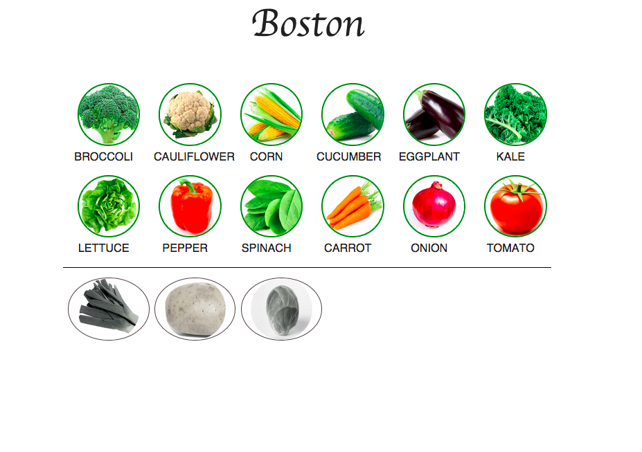

InSeason? is a single page Rails app that shows users what vegetables are in season!

It currently only works in the Boston area. Next steps are to add geocoding, location awareness, and a whole lot more data.

Screenshot: 
